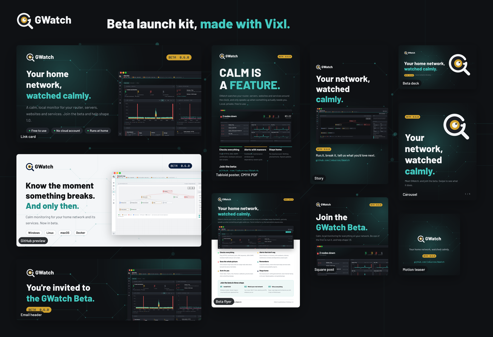

# GWatch Beta launch kit

Marketing for the GWatch Beta, made with [Vixl](https://github.com/jxburros/Vixl) 0.19.0. The kit
is mostly about **what GWatch is and why it's good**. The beta invitation comes after that: install
0.6.0, run it on a real network, and report bugs, rough edges and feature requests.



Ready-to-paste text (taglines, the announcement post, social captions, the email invitation and a
beta FAQ) is in **[COPY.md](COPY.md)**.

## What's in it

| Piece | Files | Use |
| --- | --- | --- |
| Link card | [`social/og-card-1200x630.png`](output/social/og-card-1200x630.png) | Open Graph image, link previews in Slack, Discord, X and so on |
| GitHub social preview | [`social/github-preview-1280x640.png`](output/social/github-preview-1280x640.png) | Repository Settings → Social preview (light theme) |
| Square post | [`social/square-1080x1080.png`](output/social/square-1080x1080.png) | X, Bluesky, Mastodon, Instagram, LinkedIn |
| Story | [`social/story-1080x1920.png`](output/social/story-1080x1920.png) | Instagram/Facebook stories; top and bottom 250 px kept clear of platform UI |
| Email header | [`social/email-header-1200x400.png`](output/social/email-header-1200x400.png) | The beta invitation email, newsletter or forum post header |
| Carousel, 6 slides | [`carousel/`](output/carousel/): PDF, one PNG per slide, contact sheet | 1080 × 1350 Instagram carousel or LinkedIn document post |
| Beta deck, 9 slides | [`deck/`](output/deck/): PDF, editable PPTX, self-contained HTML presenter | A walkthrough for a meetup, a call or a homelab group. Speaker notes on every slide |
| Beta flyer | [`print/beta-flyer-letter.pdf`](output/print/beta-flyer-letter.pdf) (vector) and PNG | US Letter handout: what it is, six reasons it's good, how to join |
| Tabloid poster | [`print/poster-tabloid.pdf`](output/print/poster-tabloid.pdf) (CMYK, bleed) and PNG preview | 11 × 17 in, for a makerspace, office or event wall |
| Motion teaser | [`motion/teaser.mp4`](output/motion/teaser.mp4), [`teaser.gif`](output/motion/teaser.gif), contact sheet | 7.2 s, 1080 × 1080: *Ping. HTTPS. DNS. SNMP. Watched.*, then the end card |

Each piece also has its editable `.vixl` master next to the exports (open or change it with the
`vixl` CLI, Python or MCP), and a `.check.json` with the `vixl check` findings it shipped with.

## Rebuild

From the repository root:

```bash
npm ci                                   # once: Playwright, for the screenshots
node marketing/beta/screenshots.mjs      # refresh screens/*.png from the real interface
python -m pip install 'vixl[pdf] @ https://github.com/jxburros/Vixl/archive/refs/tags/v0.19.0.tar.gz'
python marketing/beta/build.py           # everything, about 2 minutes
python marketing/beta/build.py og deck   # just some pieces
```

Barlow and Kode Mono (the interface's own fonts) download from Google Fonts on the first run and
are embedded in each master. The MP4 needs `ffmpeg`.

## How it's built

- **The brand is the product's own.** Colours come from `web/app.css` (background `#0F1114`,
  accent teal `#43C9C0`, the up/degraded/down status colours) and the logo's gold `#D3A32E` and
  navy `#061B3B`. The type is Barlow and Kode Mono, as in the interface. The mark is rebuilt as
  editable Vixl vector paths from the geometry in `web/logo.svg` and `web/logo-dark.svg` (Vixl
  cannot place an SVG file directly), and the background topology is drawn from
  `web/signal-field.svg`.
- **The screenshots are the real interface.** [`screenshots.mjs`](screenshots.mjs) serves `web/`
  and opens each page with `?mock=1`, GWatch's built-in demo network, so the dashboard, map and
  wallboard show realistic data without exposing anyone's network. It removes the orange "Mock
  data" banner before each shot. The carousel says the images come from the demo network.
- **Facts in the copy** come from the 0.6.0 README, CHANGELOG and `docs/`:
  - 10 check types: Ping, HTTP/S, HTTPS certificate, TCP port, DNS, Keyword, JSON, Custom script,
    Hardware health and SNMP.
  - 8 ways to notify or act: email, webhooks, Slack, Teams, ntfy, Pushover, git and scripts.
  - 3 database choices: embedded SQLite, PostgreSQL and MySQL/MariaDB.
  - 5 places it runs: Windows, Linux, macOS, Docker and Raspberry Pi.
  - 0 cloud accounts.
  - Every release signed.

  If any of these change, edit `VERSION`, `CHECKS`, `NOTIFY` and the stat lists in `build.py`,
  and the same lines in COPY.md.
- **No "open source" claim.** The [GWatch Community License](../../LICENSE) is source-available
  with resale restrictions, so the copy says "free to use" and "source available" instead.

## Checks

Every piece runs `vixl check` before export, and none has an open `fix` finding. The remaining
`.check.json` entries are deliberate:

- Glows, the topology field and screenshots that run off the edge are marked as intentional crops.
  The field is marked as decoration, so it doesn't count as overlapping the text.
- On the deck and carousel, `deck` review notes about projected type size, words per slide and the
  number of type sizes. These pieces are made to be read on a screen, or presented on a monitor at
  a meetup, rather than projected in a large hall.

## A GWatch bug found while making this

GWatch 0.6.0's `web/app.js` contains double-encoded UTF-8, so the header indicators read
`Nodes down â€" 2` instead of `Nodes down — 2`, and the page title has the same problem.
`screenshots.mjs` corrects it in the browser only, so the images show the intended text. The
source still needs fixing before the beta announcement goes out.
